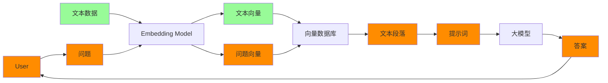
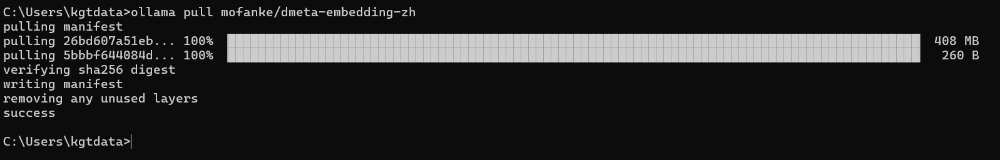
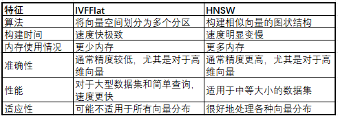
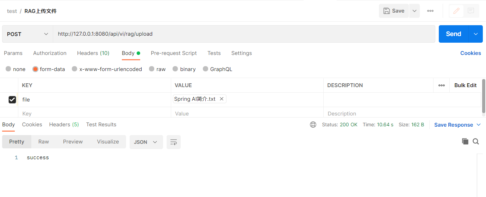
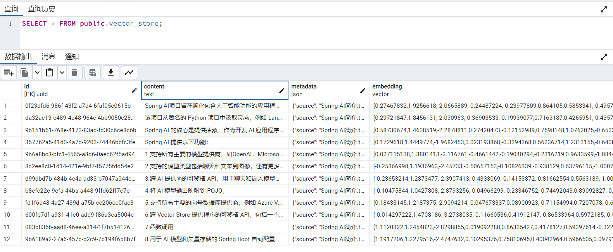
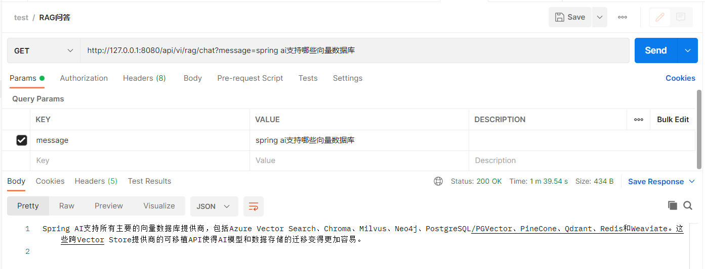

# Spring AI+Ollama+pgvector实现本地RAG

## 前言

之前写过一篇[Spring AI+Ollama本地环境搭建](https://www.bxmdm.com/archives/2024030801)的文章，本篇在此基础上进一步搭建本地RAG。RAG是目前大模型应用落地的一套解决方案，中文名叫检索增强，由于大语言模型有时效性和幻觉等局限性，使用RAG方案，先利用搜索技术从本地知识中搜索出想要的相关信息，在将相关信息组成prompt中上下文的一部分，在由大模型根据prompt进行回复。本次就构建一个demo，使用RAG技术构建一个文档问答的应用。如图所示，RAG文档问答的整体流程大致分成两个阶段：

1、数据准备，将待文本数据通过embedding模型转成文本向量，并存储到向量数据库中。

2、用户提问，将用户提出的文本通过embedding模型转成问题文本向量，并在向量库中进行搜索，搜索得到一些文本段落，将搜索到的文本段落组装成prompt去调用大模型来获得答案。



本次demo中，整体流程的业务逻辑都通过spring ai来实现，spring ai支持调用Ollama来实现chat和embedding，支持pgvector来作为向量数据存储和搜索，所以选择的模型和数据库信息如下：

模型运行工具：Ollama

embedding模型： mofanke/dmeta-embedding-zh（中文支持比较好）

大模型：qwen:7b（中文支持比较好）

向量数据库：pgvector（postgresql）


**工程完整代码:**

https://github.com/jianyuan1991/ragdemo

https://gitee.com/jianyuan/ragdemo

## 环境准备

### Ollama和模型

Ollama本地部署

下载qwen:7b:

```powershell
ollama run qwen:7b
```

*Ollama部署和qwen模型下载可以参考[Spring AI+Ollama本地环境搭建](https://www.bxmdm.com/archives/2024030801)*


下载embedding模型:

```powershell
ollama pull  mofanke/dmeta-embedding-zh
```




### pgvector

pgvector是postgresql的一个扩展，使得postgresql能够存储和搜索向量数据，pgvector 提供 2 种类型的索引，IVFFlat 和 HNSW，都是近似最近邻 （ANN） 索引，索引可以加快搜索相似向量的速度。以下是它们的主要区别：



另外pgvector 引入了三个可用于计算相似度的新运算符： <-> – 欧几里得距离、<#> – 负内积、<=> – 余弦距离

本次demo采用docker安装pgvector:

```
docker run --name pgvector \
    -e POSTGRES_PASSWORD=postgres \
    -p 5432:5432 \
	-d pgvector/pgvector:pg16
```


## 业务实现

### 数据准备

本次demo文本数据读取txt文件，spring ai中实现了TextReader用于读取txt文件，部分源码如下，比较简单，没有对文本内容进行解析（文本内容的解析在RAG中很重要，直接影像RAG中文本信息的搜索效果）。

```java
String document = StreamUtils.copyToString(this.resource.getInputStream(), this.charset);

// Inject source information as a metadata.
this.customMetadata.put(CHARSET_METADATA, this.charset.name());
this.customMetadata.put(SOURCE_METADATA, this.resource.getFilename());

return List.of(new Document(document, this.customMetadata));
```

本次demo重新实现TXT的读取，根据回车符对文本内容进行分段，并采用窗口模式对分段内容进行文档划分，可以先复制TextReader代码，新建“ParagraphTextReader”实现类，部分实现代码如下：

```java
/**
* 默认窗口大小，为1
*/
private static final int DEFAULT_WINDOW_SIZE = 1;

/**
* 窗口大小，为段落的数量，用于滚动读取
*/
private int windowSize = DEFAULT_WINDOW_SIZE;

public static final String START_PARAGRAPH_NUMBER = "startParagraphNumber";
public static final String END_PARAGRAPH_NUMBER = "endParagraphNumber";

/**
* 读取文本内容,并根据换行进行分段,采用窗口模式,窗口为段落的数量
*
* @return 文档信息列表
*/
@Override
public List<Document> get() {
    try {

        List<Document> readDocuments = new ArrayList();
        String document = StreamUtils.copyToString(this.resource.getInputStream(), this.charset);

        // Inject source information as a metadata.
        this.customMetadata.put(CHARSET_METADATA, this.charset.name());
        this.customMetadata.put(SOURCE_METADATA, this.resource.getFilename());
		
        //文本内容根据回车符进行分段
        List<String> paragraphs = Arrays.asList(document.split("\n"));

        //采用窗口滑动读取分段内容
        int startIndex = 0;
        int endIndex = startIndex + this.windowSize;
        if (endIndex > paragraphs.size()) {
            readDocuments.add(this.toDocument(paragraphs, startIndex + 1, paragraphs.size()));
        } else {
            for (; endIndex <= paragraphs.size(); startIndex++, endIndex++) {
                readDocuments.add(this.toDocument(ListUtil.sub(paragraphs, startIndex, endIndex), startIndex + 1, endIndex));
            }
        }
        return readDocuments;
    } catch (IOException e) {
        throw new RuntimeException(e);
    }
}

/**
 * 封装段落成文档
 * @param paragraphList 段落内容列表
 * @param startParagraphNum 开始段落编码
 * @param endParagraphNum 结束段落编码
 * @return 文档信息
 */
private Document toDocument(List<String> paragraphList, int startParagraphNum, int endParagraphNum) {
    Document doc = new Document(String.join("\n", paragraphList));
    doc.getMetadata().putAll(this.customMetadata);
    doc.getMetadata().put(START_PARAGRAPH_NUMBER, startParagraphNum);
    doc.getMetadata().put(END_PARAGRAPH_NUMBER, endParagraphNum);
    return doc;
}
```


构建文件上传接口用来接收TXT文件，部分代码如下:

```java
@PostMapping("/upload")
public ResponseEntity upload(@RequestBody MultipartFile file) {
    documentService.uploadDocument(file);
    return ResponseEntity.ok("success");
}
```


documentService服务中实现文件的上传解析,并使用spring ai中的VectorStore存储数据，部分代码如下:

```java
@Autowired
private VectorStore vectorStore;

private static final String PATH = "D:\\demo\\ai\\path\\";

/**
 * 使用spring ai解析txt文档
 *
 * @param file
 * @throws MalformedURLException
 */
public void uploadDocument(MultipartFile file) {
    //保存file到本地
    String textResource = file.getOriginalFilename();
    //判断文件是否是TXT
    if (!textResource.endsWith(".txt")) {
        throw new RuntimeException("只支持txt格式文件");
    }
    String filepath = PATH + textResource;
    File file1 = new File(filepath);
    if(file1.exists()){
        throw new RuntimeException("文件已存在");
    }
    try {
        file.transferTo(file1);
    } catch (Exception e) {
        e.printStackTrace();
    }
    List<Document> documentList = paragraphTextReader(file1);
    vectorStore.add(documentList);
}

private List<Document> paragraphTextReader(File file) {
    List<Document> docs = null;
    try {
        //这里我们设置滑动窗口大小为5
        ParagraphTextReader reader = new ParagraphTextReader(new FileUrlResource(file.toURI().toURL()), 5);
        reader.getCustomMetadata().put("filename", file.getName());
        reader.getCustomMetadata().put("filepath", file.getAbsolutePath());
        docs = reader.get();
    } catch (Exception e) {
        e.printStackTrace();
    }
    return docs;
}
```


### 用户提问

用户提问需要先根据问题从向量库中搜索响应的段落，由于demo中文本解析使用滑动窗口的模型进行读取，这里需要对搜索结果进行一次合并，代码部分如下：

```java
/**
 * 合并文档列表
 * @param documentList 文档列表
 * @return 合并后的文档列表
 */
private List<Document> mergeDocuments(List<Document> documentList) {
	List<Document> mergeDocuments = new ArrayList();
	//根据文档来源进行分组
	Map<String, List<Document>> documentMap = documentList.stream().collect(Collectors.groupingBy(item -> ((String) item.getMetadata().get("source"))));
	for (Entry<String, List<Document>> docListEntry : documentMap.entrySet()) {
		//获取最大的段落结束编码
		int maxParagraphNum = (int) docListEntry.getValue()
				.stream().max(Comparator.comparing(item -> ((int) item.getMetadata().get(END_PARAGRAPH_NUMBER)))).get().getMetadata().get(END_PARAGRAPH_NUMBER);
		//根据最大段落结束编码构建一个用于合并段落的空数组
		String[] paragraphs = new String[maxParagraphNum];
		//用于获取最小段落开始编码
		int minParagraphNum = maxParagraphNum;
		for (Document document : docListEntry.getValue()) {
			//文档内容根据回车进行分段
			String[] tempPs = document.getContent().split("\n");
			//获取文档开始段落编码
			int startParagraphNumber = (int) document.getMetadata().get(START_PARAGRAPH_NUMBER);
			if (minParagraphNum > startParagraphNumber) {
				minParagraphNum = startParagraphNumber;
			}
			//将文档段落列表拷贝到合并段落数组中
			System.arraycopy(tempPs, 0, paragraphs, startParagraphNumber-1, tempPs.length);
		}
		//合并段落去除空值,并组成文档内容
		Document mergeDoc = new Document(ArrayUtil.join(ArrayUtil.removeNull(paragraphs), "\n"));
		//合并元数据
		mergeDoc.getMetadata().putAll(docListEntry.getValue().get(0).getMetadata());
		//设置元数据:开始段落编码
		mergeDoc.getMetadata().put(START_PARAGRAPH_NUMBER, minParagraphNum);
		//设置元数据:结束段落编码
		mergeDoc.getMetadata().put(END_PARAGRAPH_NUMBER, maxParagraphNum);
		mergeDocuments.add(mergeDoc);
	}
	return mergeDocuments;
}

/**
	 * 根据关键词搜索向量库
	 *
	 * @param keyword 关键词
	 * @return 文档列表
	 */
public List<Document> search(String keyword) {
    return mergeDocuments(vectorStore.similaritySearch(keyword));
}
```


接下来构建封装prompt和调用大模型的方法，代码部分如下:

```java
/**
 * 问答,根据输入内容回答
 * @param message 输入内容
 * @return 回答内容
 */
public String chat(String message) {
	//查询获取文档信息
	List<Document> documents = search(message);
	
	//提取文本内容
	String content = documents.stream()
			.map(Document::getContent)
			.collect(Collectors.joining("\n"));
	
	//封装prompt并调用大模型
	String chatResponse = ollamaChatClient.call(getChatPrompt2String(message, content));
	return chatResponse;
}

/**
 * 获取prompt
 * @param message 提问内容
 * @param context 上下文
 * @return prompt
 */
private String getChatPrompt2String(String message, String context) {
	String promptText = """
			请用仅用以下内容回答"%s":
			%s
			""";
	return String.format(promptText, message, context);
}
```


再构建一个接口用于用于提问，代码部分如下:

```java
@GetMapping("/chat")
public ResponseEntity chat(@RequestParam String message) {
    return ResponseEntity.ok(documentService.chat(message));
}
```


配置信息

最后需要配置文件中配置向量数据库、embedding和大模型chat信息，application.yml配置部分如下:

```yaml
spring:
  datasource:
    url: jdbc:postgresql://192.168.3.220:5432/postgres
    username: postgres
    password: postgres
  ai:
    vectorstore:
      pgvector:
      	##embedding的向量维度，这里的768是根据nomic-embed-text返回的向量维度配置的
        dimensions: 768
    ollama:
      base-url: http://localhost:11434
      chat:
        model: qwen:7b
      embedding:
        model: nomic-embed-text
```


测试embedding模型的向量维度可以写一个测试方法来获取，代码部分如下：

```java
@Autowired
private EmbeddingClient embeddingClient;

@Test
void embeddingDimensionsTest(){
    //打印embedding模型的转换向量的维度
	System.out.println(embeddingClient.dimensions());
}
```


## 测试

### 上传数据

准备了springAI简介信息作为测试数据[Spring AI :: Spring AI Reference](https://docs.spring.io/spring-ai/reference/index.html)，翻译如下：

```
Spring AI项目旨在简化包含人工智能功能的应用程序的开发，而不会造成不必要的复杂性。
该项目从著名的 Python 项目中汲取灵感，例如 LangChain 和 LlamaIndex，但 Spring AI 并不是这些项目的直接移植。 该项目成立的信念是，下一波生成式 AI 应用程序将不仅适用于 Python 开发人员，而且将在许多编程语言中无处不在。
Spring AI 的核心是提供抽象，作为开发 AI 应用程序的基础。 这些抽象具有多种实现，只需最少的代码更改即可轻松交换组件。
Spring AI 提供以下功能：
1.支持所有主要的模型提供商，如OpenAI，Microsoft，Amazon，Google和Huggingface。
2.支持的模型类型包括聊天和文本到图像，还有更多类型正在开发中。
3.跨 AI 提供商的可移植 API，用于聊天和嵌入模型。支持同步和流 API 选项。还支持下拉以访问特定于模型的功能。
4.将 AI 模型输出映射到 POJO。
5.支持所有主要的向量数据库提供商，例如 Azure Vector Search、Chroma、Milvus、Neo4j、PostgreSQL/PGVector、PineCone、Qdrant、Redis 和 Weaviate
6.跨 Vector Store 提供程序的可移植 API，包括一个类似 SQL 的新颖元数据过滤器 API，该 API 也是可移植的。
7.函数调用
8.用于 AI 模型和矢量存储的 Spring Boot 自动配置和启动器。
9.用于数据工程的 ETL 框架
通过此功能集，您可以实现常见用例，例如“文档问答”或“与文档聊天”。
概念部分提供了 AI 概念及其在 Spring AI 中的表示的高级概述。
“入门”部分介绍了如何创建第一个 AI 应用程序。 后续部分将采用以代码为中心的方法深入探讨每个组件和常见用例。
```


使用postman调用接口:



本次demo使用向量数据库问pgvector，项目启动后，spring ai会连接pgvector自动创建vector_store表，当然也手动提前创建:

```sql
CREATE EXTENSION IF NOT EXISTS vector;
CREATE EXTENSION IF NOT EXISTS hstore;
CREATE EXTENSION IF NOT EXISTS "uuid-ossp";

CREATE TABLE IF NOT EXISTS vector_store (
	id uuid DEFAULT uuid_generate_v4() PRIMARY KEY,
	content text,
	metadata json,
	embedding vector(768) # 768 是embedding模型nomic-embed-text的维度
);

CREATE INDEX ON vector_store USING HNSW (embedding vector_cosine_ops);
```


测试过后可以连接数据库查询vector_store表的数据:




### 问答测试

数据准备阶段已经测试完成，接下来可以测试问答，使用postman调用接口:



*本地CPU运行大模型还是太慢了，一个接口跑了1分半多。*


## 总结

Spring AI结合Ollama和pgvector能很方便的构建一个RAG文档问答应用。RAG效果受到文档的拆分、embedding、段落搜索、prompt模板、大模型这些因素的影响，要想优化的话可以从这些方面去考虑。


**参考：**

[pgvector/pgvector: Open-source vector similarity search for Postgres (github.com)](https://github.com/pgvector/pgvector)

[PGvector :: Spring AI Reference](https://docs.spring.io/spring-ai/reference/api/vectordbs/pgvector.html)

[Ollama Chat :: Spring AI Reference](https://docs.spring.io/spring-ai/reference/api/clients/ollama-chat.html)

[Ollama Embeddings :: Spring AI Reference](https://docs.spring.io/spring-ai/reference/api/embeddings/ollama-embeddings.html)

[qwen (ollama.com)](https://ollama.com/library/qwen)

[mofanke/dmeta-embedding-zh (ollama.com)](https://ollama.com/mofanke/dmeta-embedding-zh)